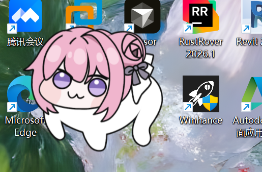
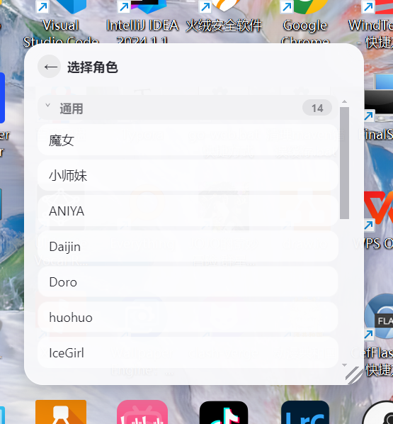
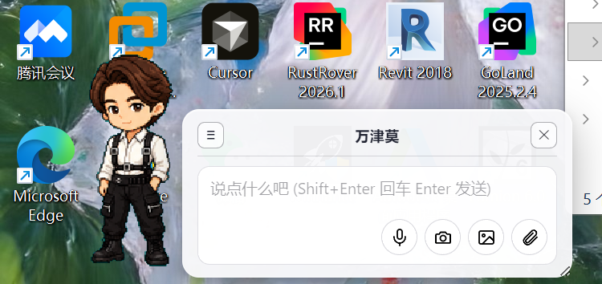
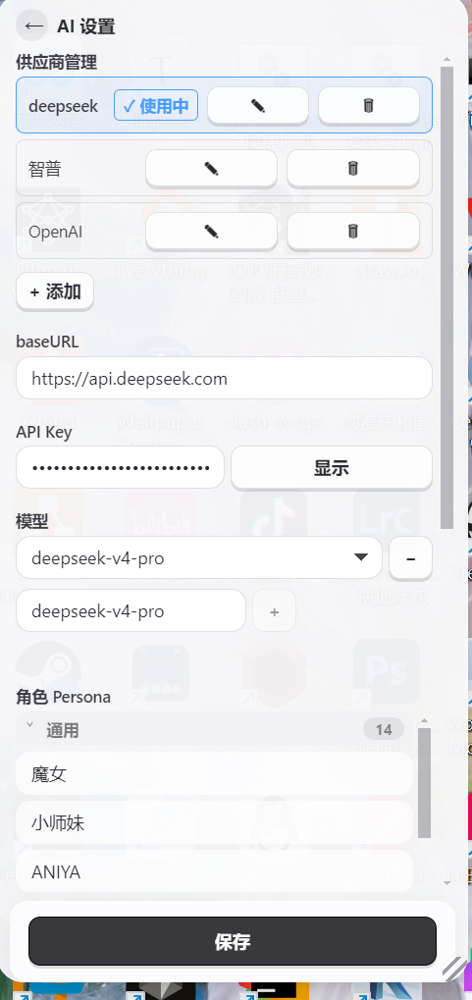
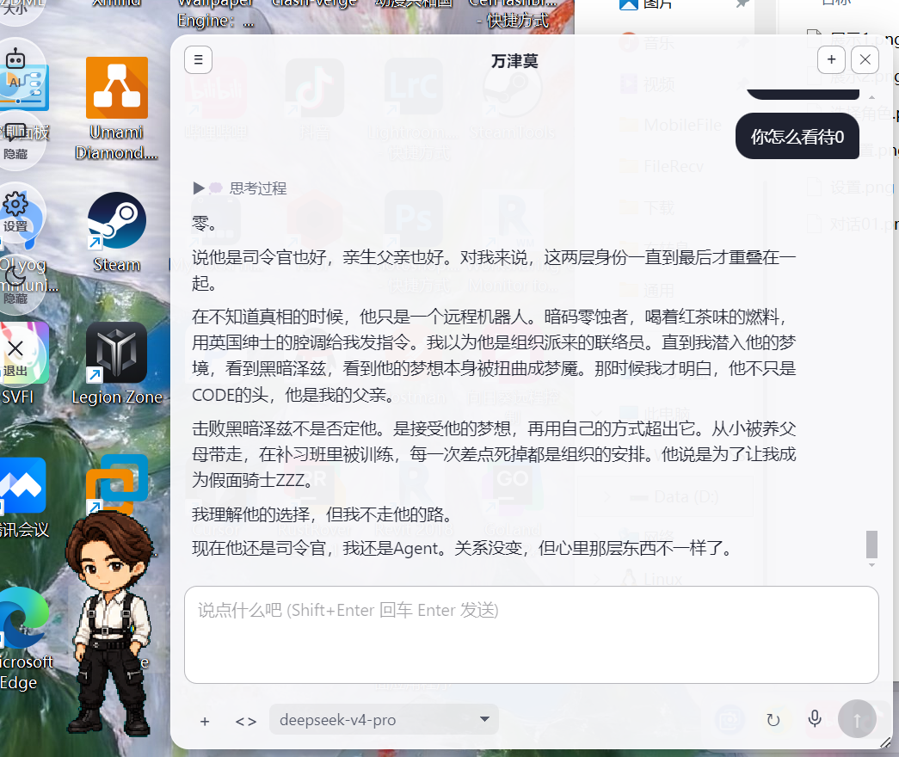
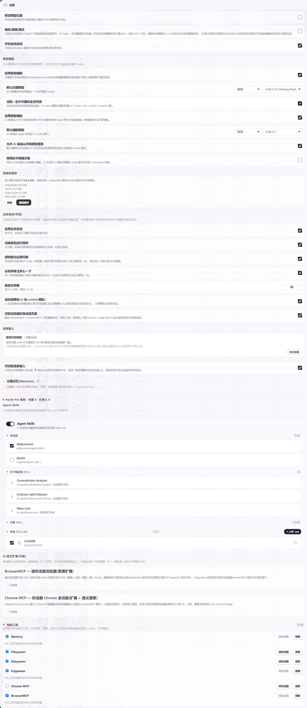
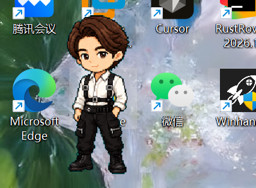

# Desktop Pet

一个基于 Electron、React、TypeScript、PIXI 和 Live2D 的桌面宠物应用。它可以在桌面上显示 Live2D 模型或 Codex `hatch-pet` 生成的 8x9 精灵图桌宠，并提供 AI 对话、角色人设、模型动作表情联动、语音输入、Agent Skills 和 MCP 工具扩展。

项目目前主要面向 Windows 桌面环境开发。

## 效果预览

| 桌宠展示 | 角色选择 |
| --- | --- |
|  |  |

| 对话效果 | AI 设置 |
| --- | --- |
|  |  |

| 对话与工具 | 设置面板 |
| --- | --- |
|  |  |



## 功能特性

- 支持 Live2D Cubism 4 模型加载、表情和动作触发。
- 支持按目录分类管理 Live2D 模型。
- 支持 Codex `hatch-pet` 生成的桌宠包，格式为 `pet.json + spritesheet.webp`。
- 支持导入用户自己的 Hatch-Pet 角色。
- 支持设置默认启动模型；未设置时默认打开第一个 Hatch-Pet。
- 支持 AI 对话气泡、角色 Persona、人设和说话风格配置。
- 支持根据 AI 回复触发不同表情和动作。
- 支持 MCP 工具和 Agent Skills，让 AI 可以扩展读屏、读文件、联网查询等能力。
- 支持离线语音输入，使用内置 Vosk small 中文模型。
- 支持托盘菜单、桌宠隐藏、开机自启动、模型缩放、位置锁定等桌面交互。

## 技术栈

- Electron 33
- Vite 5
- React 18
- TypeScript
- PIXI.js
- pixi-live2d-display-lipsyncpatch
- Vosk Browser
- Model Context Protocol SDK

## 快速开始

需要先安装 Node.js，建议使用 LTS 版本。

```bash
cd app
npm install
npm run dev
```

启动后右键桌宠可以打开菜单，在设置里配置 AI、角色、人设、语音输入和工具能力。

## AI 配置

打开桌宠菜单后进入 `AI` 面板，填写：

- `baseURL`，例如 `https://api.openai.com/v1` 或其他 OpenAI 兼容接口。
- `API Key`
- `模型名`，例如 `gpt-4o-mini`、`deepseek-chat` 等。

角色 Persona 在同一面板里配置。每个模型可以有独立的人设、对话名称和说话风格。

## 模型目录

### Hatch-Pet

内置 Hatch-Pet 模型放在：

```text
app/hatch-pet/<角色名>/pet.json
app/hatch-pet/<角色名>/spritesheet.webp
```


### Live2D


你可以在本地按下面的结构添加模型：

```text
app/live2d/通用/模型名/xxx.model3.json
app/live2d/其他分类/模型名/xxx.model3.json
```

应用会自动扫描 `app/live2d` 下的分类和模型。

## 默认启动模型

默认逻辑：

1. 如果在设置里选择了“默认打开模型”，启动时使用该模型。
2. 如果没有设置，启动时打开第一个 Hatch-Pet。
3. 如果没有 Hatch-Pet，再回退到第一个 Live2D。

设置路径：

```text
右键桌宠 -> 设置 -> 默认打开模型
```

## 打包

常用打包命令：

```bash
cd app
npm run build:live2d:none
npm run build:live2d:common
npm run build:live2d:all
```

也可以使用项目里的细分打包配置：

```bash
cd app
npx electron-builder --config electron-builder.models-all.yml
npx electron-builder --config electron-builder.models-no-abstract-naruto.yml
npx electron-builder --config electron-builder.models-common-maodie.yml
```

打包产物默认输出到：

```text
app/dist-app/
```

## 目录结构

```text
Desktop pet/
├─ app/
│  ├─ electron/              # Electron 主进程、IPC、资源扫描、工具管理
│  ├─ src/                   # React 渲染进程、桌宠 UI、聊天气泡、模型渲染
│  ├─ shared/                # 主进程和渲染进程共享类型、情绪映射、人设配置
│  ├─ hatch-pet/             # Hatch-Pet 桌宠资源
│  ├─ live2d/                # Live2D 根目录，开源仓库只保留 .gitkeep
│  ├─ picture/               # README 效果图
│  ├─ VOSK/                  # 内置语音识别模型
│  └─ package.json
├─ README.md
└─ PROJECT_DESCRIPTION.md
```

## 开源与素材说明

建议本项目源码使用 MIT License 开源。

注意：源码许可证不代表仓库中的所有素材都可以自由使用。Live2D 模型、角色图片、音频、字体、第三方角色形象等资源可能归原作者或权利方所有。请在上传、分发或商用前确认对应素材的授权。

本仓库默认不上传 `app/live2d` 内的模型文件，只保留空目录占位，避免把未确认授权的模型一起发布。

